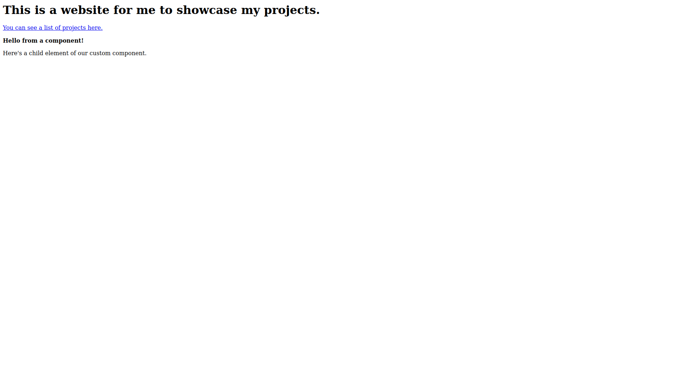

# Cedar
## A small, JavaScript-free static site generator.

Cedar is a static site generator with a strong focus on *components*. Essentially, Cedar provides a thin syntactic abstraction over HTML that allows users to reuse certain parts of their code without the complexity of something like JSX.

# Installation
Clone this repo, then run `cargo install --path .` to build the CLI. Note that for this to work, you will have to append the Cargo installation directory (e.g. `.cargo/bin`) to your `PATH` environment variable. Alternatively, after cloning this repo, run `cargo r` in place of `cedar` in the commands below.

# Usage
First, write an `index.cedar` like this:
```
html {
    head {
        title { "My personal website" }
    }
    body {
        h1 { "This is a website for me to showcase my projects." }
        a [ href = "projects" ] { "You can see a list of projects here." }
    }
}
```
Running `cedar index.cedar` will compile your markup into a (somewhat minified) `index.html` file that looks like this:
```html
<html><head><title>My personal website</title></head><body><h1>This is a website for me to showcase my projects.</h1><a href="projects">You can see a list of projects here.</a></body></html>
```
Next, add a custom component in `include/custom.cedar`:
```
@def custom-component {
    p [ style = "font-weight: bold" ] { "Hello from a component!" }
    @children
}
```
The `@def` directive tells the compiler that you're defining a new component, and the `@children` specifies the position of where to render the custom component's children. Now, we can include this in our main page by putting this line at the top of `index.cedar`:
```
@include "custom.cedar"
```
We can then use this custom component somewhere; for example,
```
    body {
        h1 { "This is a website for me to showcase my projects." }
        a [ href = "projects" ] { "You can see a list of projects here." }
        @custom-component {
            "Here's a child element of our custom component."
        }
    }
```
Notice that, in our `@include` statement, we didn't qualify the entire file path of `include/custom.cedar`. That's because we'll be compiling with the `-i` flag to specify an _include directory_:
```
cedar index.cedar -i include 
```
If we take a look at our compiled `index.html` again, we'll see that the `custom-component` has been replaced with its plain HTML contents:
```html
<html><head><title>My personal website</title></head><body><h1>This is a website for me to showcase my projects.</h1><a href="projects">You can see a list of projects here.</a><p style="font-weight: bold">Hello from a component!</p>Here's a child element of our custom component.</body></html>
```
And if we look at the webpage rendered in the browser, we'll see that it's exactly what we expected:



We could also output to a different directory, such as `./out`, using the `-o` flag, if desired:
```
cedar index.cedar -i include -o out
```

# Todo
- [ ] Add file extension checking
- [ ] Add `cedar --help` and `cedar -h` subcommands to output help messages
- [ ] Add configurability for include paths, output directories, etc. via a TOML file
- [ ] Improve logic to minify generated HTML
- [ ] Add support for attributes on custom components
- [ ] Add support for multiple "child" elements in custom components
- [ ] Create converter from HTML to `.cedar`
